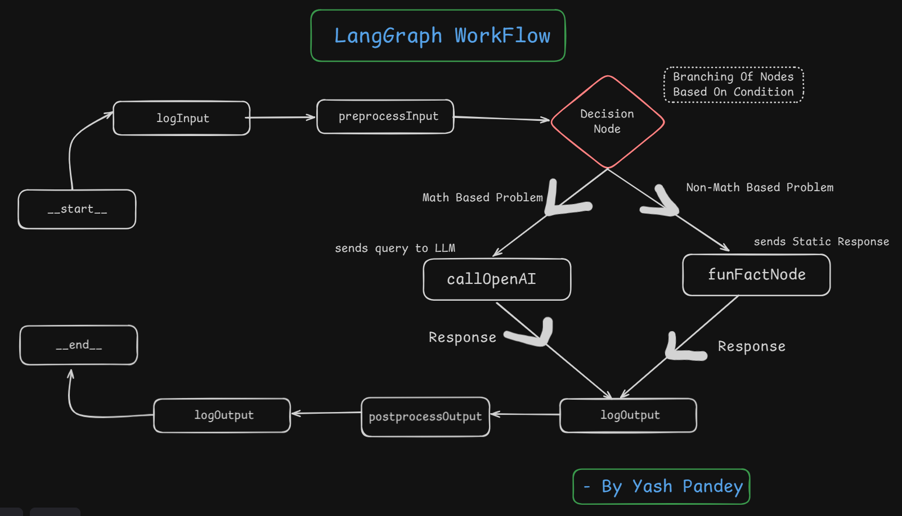
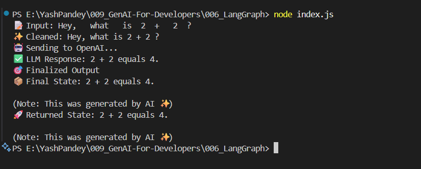
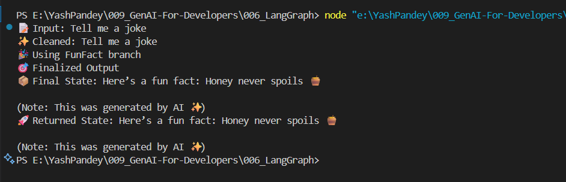
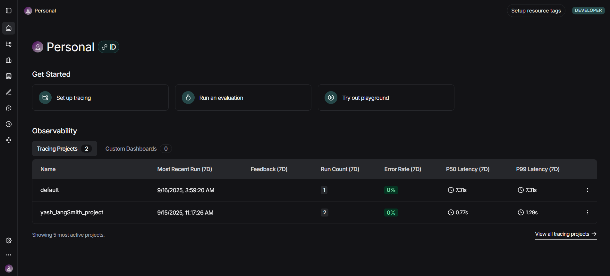
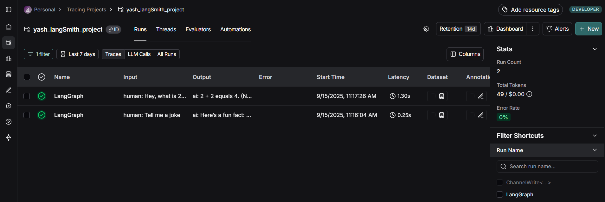
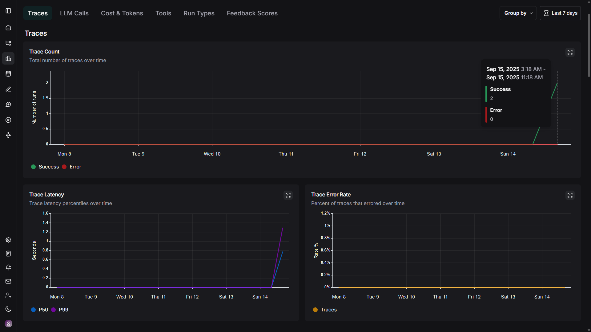

# LangGraph-BranchFlow

A beginner-friendly demo of **LangGraph** showing how to build branching workflows with multiple nodes and edges.
This project integrates **OpenAI** with conditional logic to handle **math vs non-math queries**, while also demonstrating preprocessing, postprocessing, and logging.
Now extended with **LangSmith Tracing** for project monitoring and debugging. 🚀

---

## ⚡ Features

- Input logging & preprocessing
- Branching flow (Math → OpenAI, Non-Math → Fun Fact)
- Postprocessing with AI note
- Final output logging
- **LangSmith integration for tracing and debugging**
- Clean and modular workflow design

---

## 🛠️ Workflow

Here’s the designed LangGraph workflow:

---

## 📸 Example Outputs

### Math Query

`Hey, what is 2 + 2?`

### Non-Math Query

`Tell me a fun fact`

---

## 📊 LangSmith Tracing

This project is integrated with **LangSmith** for complete visibility into node executions, branching flows, and performance.
Below are sample screenshots from LangSmith:

- **Project Overview**
  

- **Execution Calls**
  

- **Analytics & Charts**
  
